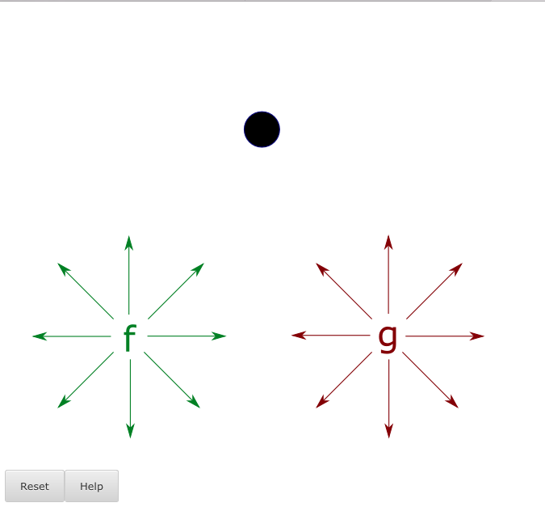

dragv2
======

Designed with problem creators in mind, dragv2 problems can be made _without writing any code_.
Features of dragv2 include:
* draggables can be .svg files, among several other file types (.png, .jpg, ...)
* draggables start at a custom location on the drop image (no inconvenient edX lists)
* draggables snap to their initial location
* reset button is _always_ present
* extremely simple and readable XML with JSInput
* specify custom sizes for your images when creating the problem with __no__ size limitations
* easily create sophisticated custom grading methods (_via python code_, see `documentation.html`)
* built-in capability for custom CSS formatting of draggables: default _and_ hover
* optional draggable expansion on hover (pre-written CSS)
* one special (readable) JSON file in the static folder per problem (on top of image files)

Getting Started
---------------
Download the contents of this repository, and open `Dragcreator.html` and `documentation.html` (in the Dragcreator folder) to start creating problems and to learn more about the Dragcreator tool and dragv2 itself.

Quick Taste
-----------
XML: __You don't have to write _any_ of this, it's done automatically__
```XML
<problem>
<script type="loncapa/python">
import json

def isNear(state,solution,init,draggableNum,id):
    return abs(state[id][0]-solution[id][0])&lt;init["draggables"][draggableNum[id]]["size"]["width"]/2 and abs(state[id][1]-solution[id][1])&lt;init["draggables"][draggableNum[id]]["size"]["height"]/2

def check(expect, ans):
    solution = eval(expect)
    par = json.loads(ans)
    init = json.loads(par["answer"])
    state = json.loads(par["state"])
    draggableNum = {init["draggables"][i]["id"]: i for i in xrange(len(init["draggables"]))}
    for draggable in init["draggables"]:
        if draggable["id"] not in solution:
            solution[draggable["id"]]=[draggable["pos"]["x"],draggable["pos"]["y"]]
    return {"ok":all([ isNear(state,solution,init,draggableNum,id) for id in state])}
</script>
<customresponse cfn="check" expect="{'greenupleft': [262,100], 'reddown': [315,225]}">
  <jsinput gradefn="JSInput.getGrade"
    get_statefn="JSInput.getState"
    set_statefn="JSInput.setState"
    width="670"
    height="630"
    html_file="/static/dragv2.html?js=example"/>
</customresponse>
</problem>
```

Here is a still example (which is by no means a well thought or well drawn problem), but you can play with the real thing if you have the files using your web browser: `file:///Users/Name/path/to/dragv2.html?js=example`


